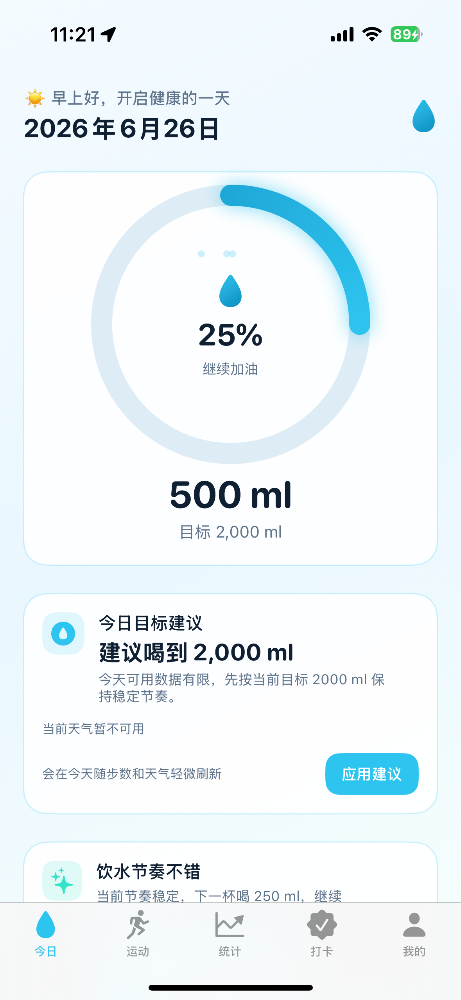
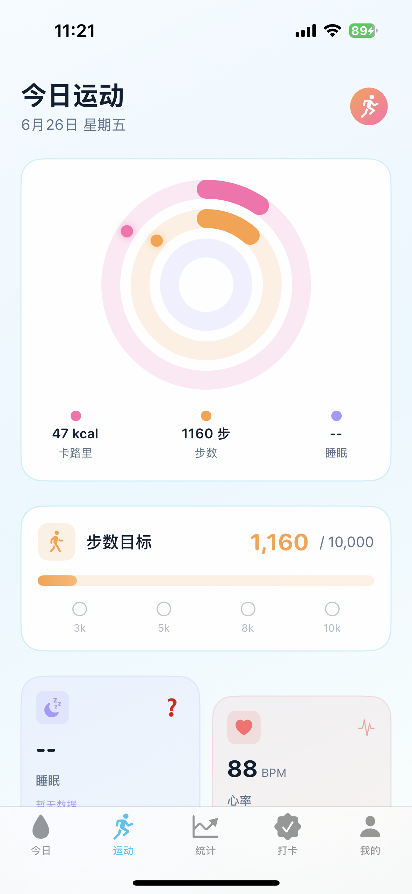
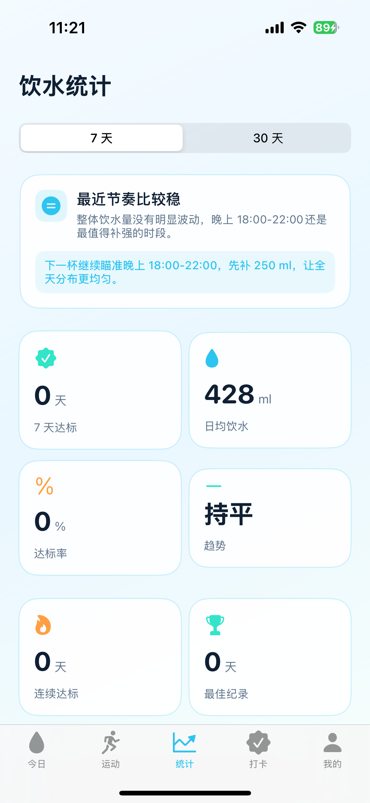
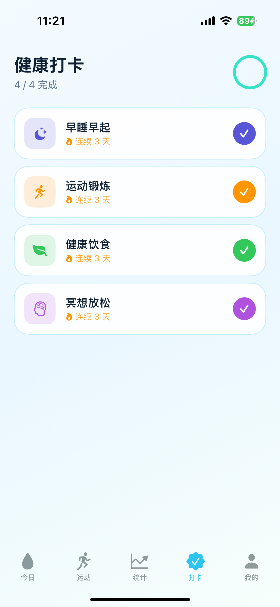
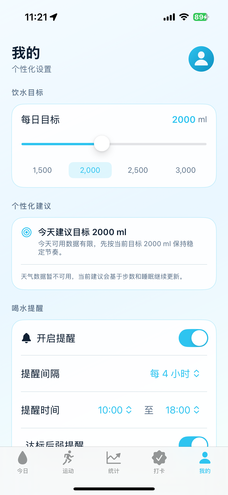

# AquaLife 💧

AquaLife 是一款设计精美、智能的 iOS 健康习惯追踪应用。它不仅提供了核心的饮水追踪功能，还深度集成了 Apple HealthKit 和天气服务，通过智能算法为你提供个性化的健康建议和运动数据可视化。

## ✨ 核心功能

- **💧 智能饮水追踪**: 通过美观的交互式进度环记录每日饮水，支持快捷打卡记录。
- **🤖 个性化目标顾问 (Smart Advisor)**: 结合用户的体重、运动量以及当地天气（如高温天气），智能动态调整每日建议的饮水量。
- **🏃‍♂️ 运动与健康数据 (Fitness & Health)**: 
  - **三环活动图**: 媲美 Apple Watch 风格的同心圆环，直观展示卡路里、步数和睡眠进度。
  - **心率与睡眠分析**: 根据睡眠时长自动评级，并展示最新的心率健康状态。
  - **7 天数据趋势**: 使用 Swift Charts 绘制平滑的步数和活动量折线面积图。
- **❤️ HealthKit 深度集成**: 无缝同步 Apple Health 数据，自动拉取步数、活动消耗能量、睡眠分析和心率。
- **📊 统计与热力图**: 提供详尽的历史数据统计、打卡日历热力图，让你对自己的坚持一目了然。
- **🔔 贴心提醒机制**: 自定义喝水提醒时间段和间隔，目标达成后自动暂停打扰。

## 🛠 技术栈

- **UI 框架**: SwiftUI, Swift Charts
- **本地存储**: SwiftData
- **健康数据**: HealthKit, CoreLocation (用于天气定位)
- **架构模式**: MVVM
- **编程语言**: Swift 
- **系统要求**: iOS 17.0+ / Xcode 16+

## 🚀 运行指南

### 前置要求
- Xcode 16.0 或更高版本
- iOS 17.0 或更高版本的模拟器或真机
- (可选) Apple 开发者账号（如果需要在真机上测试 HealthKit 授权）

### 安装步骤

1. 克隆项目到本地：
   ```bash
   git clone https://github.com/zouqiwei/AquaLife.git
   ```
2. 这个项目使用了 CocoaPods，请确保打开的是 `xcworkspace` 工作区文件：
   ```bash
   cd AquaLife
   open AquaLife.xcworkspace
   ```
3. 在 Xcode 中选择 iPhone 模拟器或连接的真机设备。
4. 点击 `Run` (或按下 `Cmd + R`) 编译并运行项目。

> **⚠️ 注意事项**：  
> 为了体验完整的运动和健康数据功能，建议在**真机**上运行。如果在模拟器上运行，请先打开模拟器自带的「健康 (Health)」App 随意添加一些测试数据（如步数、睡眠和心率），以便 AquaLife 读取并展示。

## 📱 界面预览

<p align="center">
  
  
  
  
  
</p>

## 🤝 参与贡献
欢迎提交 Issue 和 Pull Request 来帮助改进 AquaLife！

## 📄 开源协议
本项目采用 MIT License 开源协议。
